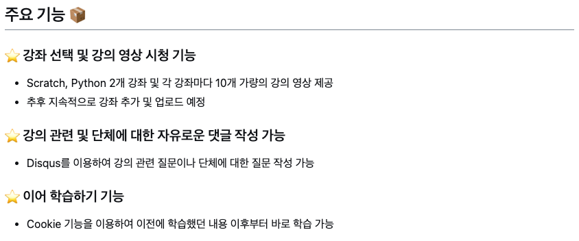
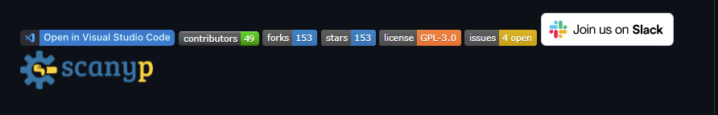
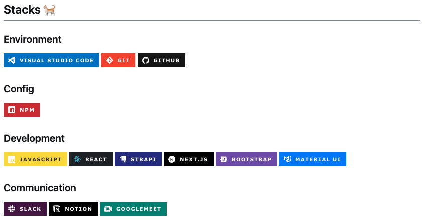
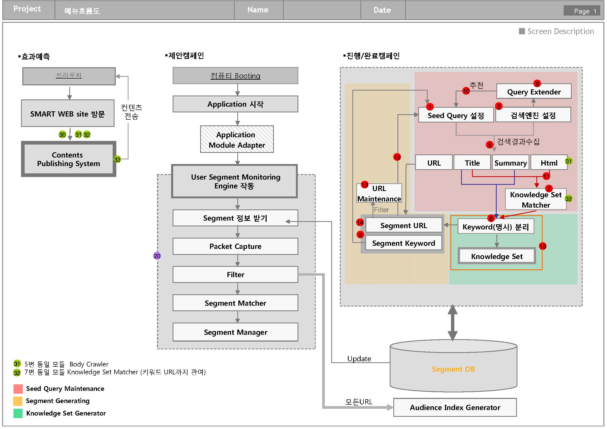
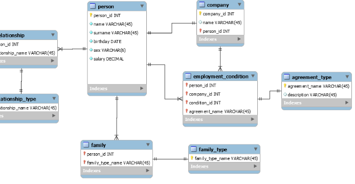

# readme 예시
## project name
## overview 프로젝트 요약 2~5줄
## 스크린샷 (스크롤이 있거나,웹처럼 여러장이 있는 경우 Gif로 만드는 걸 추천)
## 기능 정리 (기능 별 이미지 들어가면 좋음)

## 설치 방법 (기술 스택, 다운로드부터 실행까지)
## 링크 (관련 문서 링크나 동작하는 링크, 노션)
## 업데이트 내역
# ------------------------------------
## 프로젝트명
## 프로젝트 설명
- 왜 그기술을 사용했는지
- 프로젝트 진행중 당명했던 문제나 나중에 추가하고 싶은 기능이 무엇인지
## 목차
- 사용자들이 다른 섹션으로 쉽게 이동할 수 있게 목차를 만듬
## 프로젝트 설치 및 실행 방법
- 개발 환경을 세팅하고 실행할수 있는 단계적인 설명을 제공하세요
## 프로젝트 사용 방법
- 프로젝트 실행 예시 화면의 스크린샷과 같은 시각 자료를 사용할 수도 있고 프로젝트에서 사용된 구조나 디자인 원칙을 추가할 수 있습니다.
## 팀원 및 참고 자료
- 팀원들의 깃허브 담당한 작업들 작성
- 프로젝트를 진행할때 도움을 받은 링크나 다른 누군가가 실행 했을때 도움받을만한 사이트의 링크
## 라이센스
## 뱃지

## 테스트
- 애플리케이션의 테스트를 위해 예제 코드와 실행 방식을 작성

# [팀프로젝트 예시 1](https://github.com/JeongHyunJi/SosoVillage)

# [팀프로젝트 예시 2](https://github.com/am1wr0ng/2021-Probono-Project/blob/main/README.md)

# [팀프로젝트 예시 3](https://github.com/likelion-project-README/README)

# [팀프로젝트 예시 4](https://github.com/JEONGYOONHAE/PJT-BeTravelic)

# 프로젝트 관리 (todo,inprogress,done)
- github project 
- WBS
- github repository
# 프로젝트 프로세스 흐름도

# [ERD](https://www.erdcloud.com/)

# web
- spring
- django

# 크롤링

# 모델

# 주차 팀회의 기록

# 서버 구축

